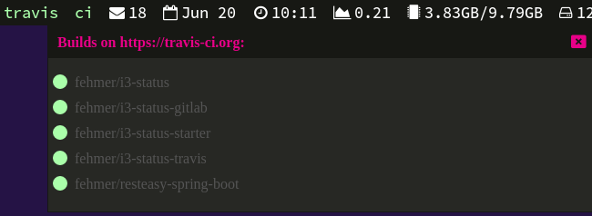

# i3-status reporters

A reporter allows any module to display additional information e.g. on a click event. You can only define and customize one reporter in i3-status. All modules will use the same reporter. 

Example output of the [i3-status-travis](https://github.com/fehmer/i3-status-travis) module, showing a list of projects and their build status.



## Table of content
<!-- MarkdownTOC -->

- [Available reporters](#available-reporters)
- [Configuration](#configuration)
- [Developing your own reporter](#developing-your-own-reporter)

<!-- /MarkdownTOC -->


## Available reporters

Currently only one reporter is available. The [i3-status-reporter-html](https://github.com/fehmer/i3-status-reporter-html) displays the content in a popup window using html.


## Configuration

You define the kind of reporter you want to use in the config YAML file.

``` yaml
main:
    [...]
reporter:
  module: i3-status-reporter-html
```

All additional configuration or customization options are based on the reporter itself. The documentation of the reporter should contain all information you need to configure your reporter.


## Developing your own reporter

If you want to implement your own reporter please have a look at the [noReporter class](../src/noReporter.js). 